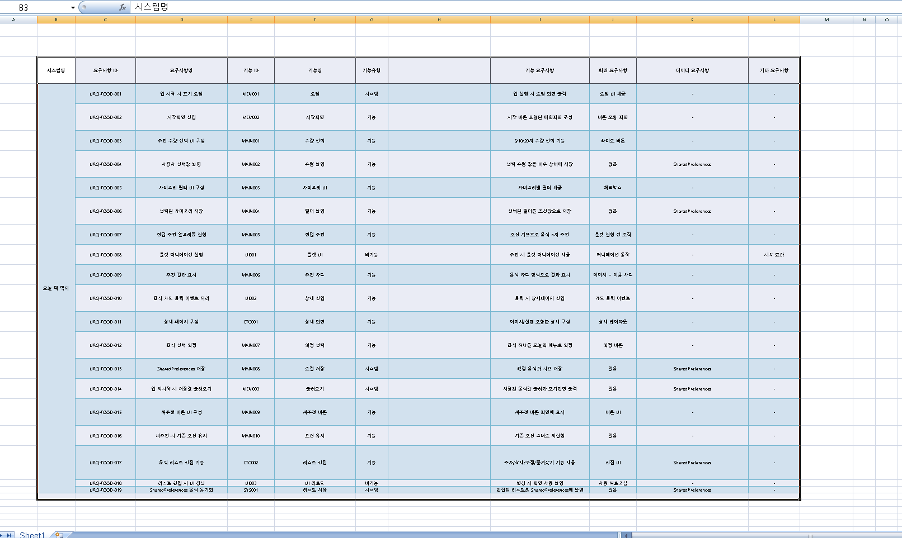

# 📱 오늘 뭐 먹지 - Flutter 앱 프로젝트

## 💻 개발 환경
- IDE: Android Studio
- 언어: Dart
- 프레임워크: Flutter
- DB:  shared_preferences 패키지 사용 * (초기 계획은 Hive v2.2.3) 사용 하기로 하였음!
- 타겟 플랫폼: Android

초기에는 Hive DB를 사용할 계획이었으나,  
앱 구조가 단순하고 사용자 인증이나 동기화 기능이 필요 없기 때문에  
**shared_preferences 패키지를 사용하는 방식으로 수정**하였습니다.

## 📋 요구사항 정의서

