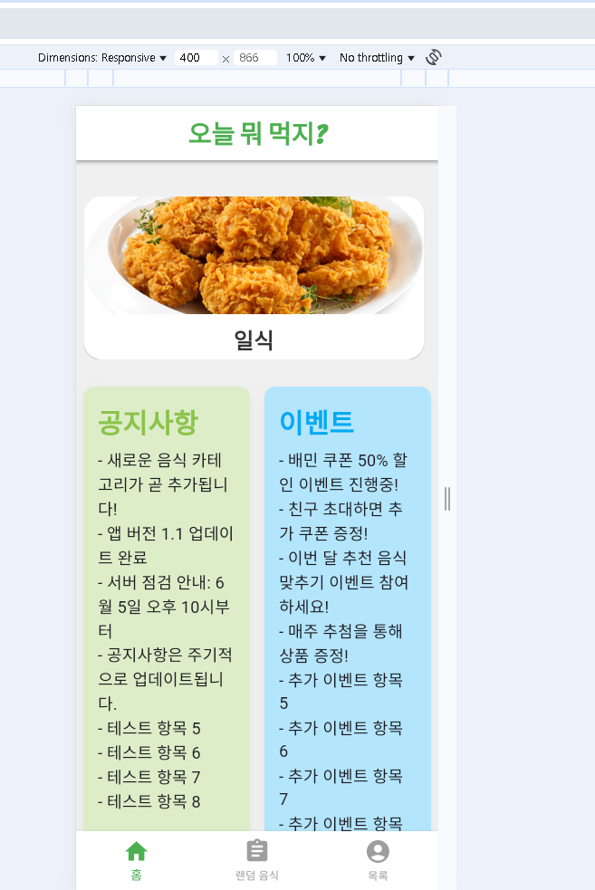
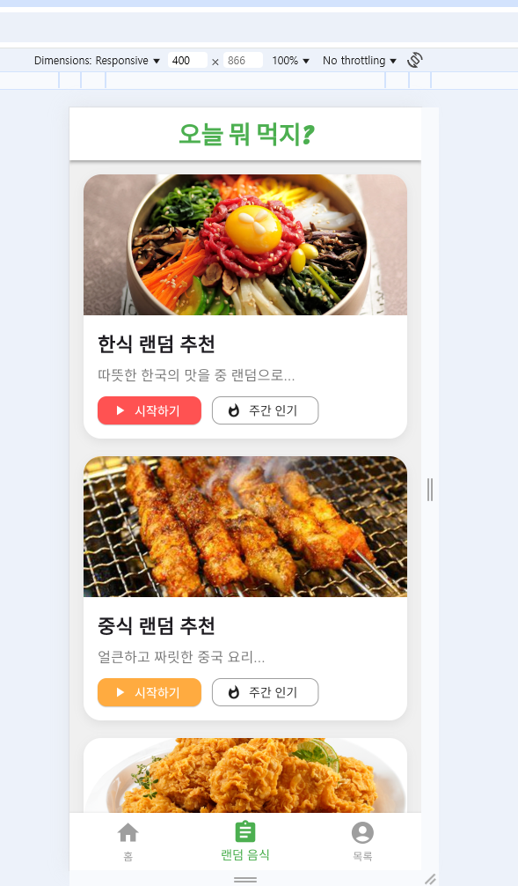
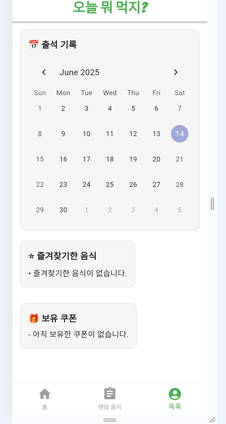

### 🗣️ 홈 화면 구성 설명 
요구사항 정의서 추가

- **상단에는 앱 타이틀과 `CarouselSlider`를 사용한 이미지 배너**가 구성되어 있습니다.  
  이 슬라이드는 추천 음식 또는 카테고리를 보여주는 시각적 효과를 담당합니다.
  일식,중식,한식 으로 3초간 보여주고 있습니다

- **공지사항 및 이벤트 영역은 `page1.dart`에서 구성**되며,  
  `Row`로 두 개의 컬러 박스를 나란히 배치해  
  유저에게 앱 정보와 이벤트를 전달하도록 설계되었습니다.

---

### 📸 메인 홈 화면

### 랜덤 음식 추천 화면 구성

- `page2.dart`는 사용자가 음식 카테고리를 선택하고,  
  해당 카테고리 내에서 **무작위 음식 추천**을 받을 수 있도록 구성되어 있습니다.

---

### 랜덤 음식 추천 화면

---

### 내 정보 페이지 입니다

- `page3.dart`는 사용자의 **출석 달력**, **즐겨찾기 목록**, **쿠폰 목록** 등을
-  카드 형태로 보여주는 화면입니다. (아직 뭐를 추가할지 고민중 입니다) 데이터 베이스 연결 아직 미흡.
- UI 구성 요소:
  - `TableCalendar`: 달력 기반 출석 UI
  - `Card`: 즐겨찾기/쿠폰 항목 표현
  - `Column` + `Divider`: 콘텐츠 구분 및 수직 정렬 

---

### 내 정보 화면

